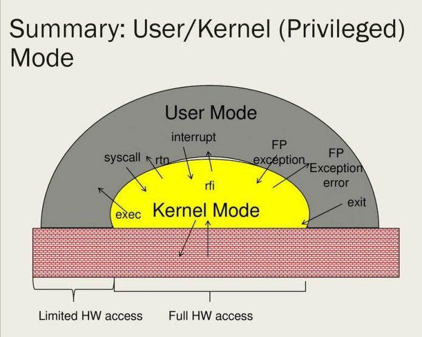

### "Build Your Own Redis" Challenge

In this challenge, you'll build a simple Redis clone that supports basic commands like `PING`, `SET`, and `GET`. Along the way, you'll learn about event loops, the Redis protocol, and more.

---

## Redis InputStream

**User Space** and **Kernel Space**: 

- **User Space**: Where user applications run, with limited access to system resources.
- **Kernel Space**: Where the operating system kernel runs, with full access to hardware.

When an application needs to perform privileged operations (like reading from disk or sending data over the network), it makes a **system call** to the kernel. This triggers a **context switch**:

1. The OS saves the current state of the user process.
2. Control switches to the kernel to perform the requested operation.
3. The OS restores the user process state and returns control.

**Context switches** have costs:
- **CPU time** for saving/restoring state.
- **Cache misses** as CPU caches may need to be reloaded.

These costs occur during system calls, task scheduling, or hardware interrupts.

When a program connects to a server (such as Redis), it cannot predict exactly how much data the server will send. Allocating a buffer that's too large wastes memory, while one that's too small is inefficient.

Performance: Reading data in a loop using a buffer is much more efficient. Instead of making a system call to read 1 byte from the socket each time you need a byte, the program makes a single I/O call to read 8KB (the default buffer size), then processes those 8KB in memory. This significantly reduces the cost of **context switching** between kernel and user space.

#### References
- [Phân biệt Kernel Space và User Space](https://vsudo.net/blog/kernel-space-va-user-space.html)
- [What is difference between User space and Kernel space?](https://unix.stackexchange.com/questions/87625/what-is-difference-between-user-space-and-kernel-space)

## RESP Handler

To communicate with the Redis server, Redis clients use a protocol called Redis Serialization Protocol (RESP). While the protocol was designed specifically for Redis, you can use it for other client-server software projects.

RESP is a compromise among the following considerations:

+ Simple to implement.
+ Fast to parse.
+ Human readable.

RESP can serialize different data types including integers, strings, and arrays. It also features an error-specific type. A client sends a request to the Redis server as an array of strings. The array's contents are the command and its arguments that the server should execute. The server's reply type is command-specific.

RESP is binary-safe and uses prefixed length to transfer bulk data so it does not require processing bulk data transferred from one process to another.

RESP is the protocol you should implement in your Redis client.

#### References

- [A simple RESP protocol implementation (Gist)](https://gist.github.com/ghoulr/15480ca71277e6681f5d)
- [Redis Protocol Specification (Official Docs)](https://redis.io/docs/latest/develop/reference/protocol-spec/)
